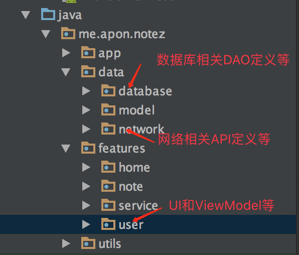
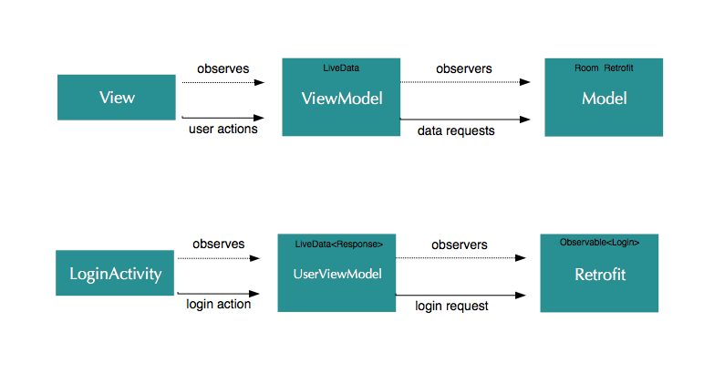
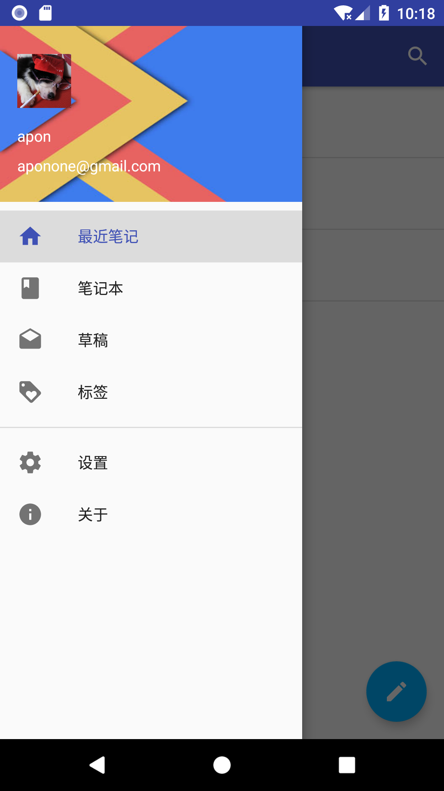
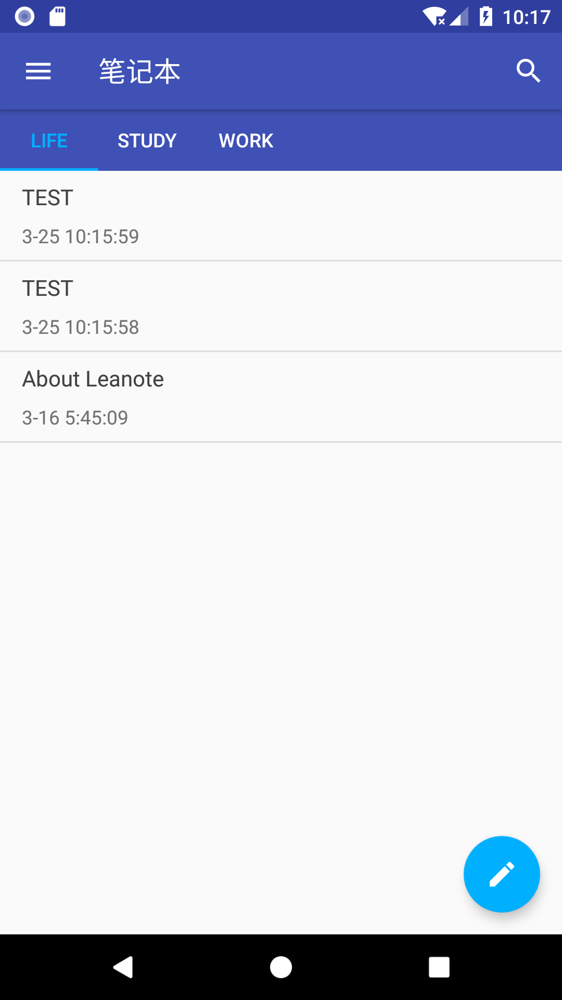
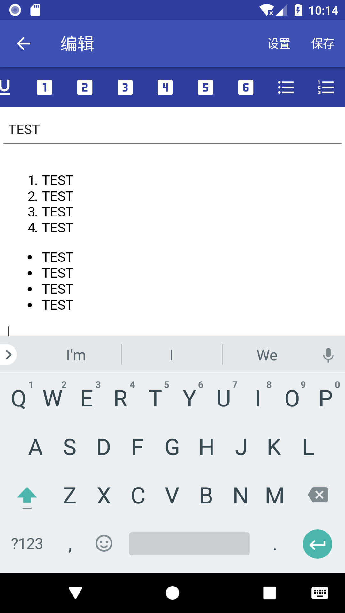
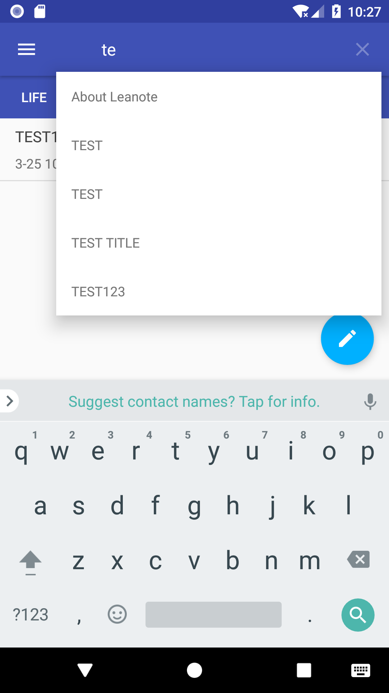

# NOTEZ-蚂蚁笔记第三方客户端


NOTEZ是[蚂蚁笔记](http://leanote.org/)的第三方Android客户端。它基于Android框架组件(LiveData+ViewModel+Room)和网络全家桶(Okhttp+RxJava+Retrofit),以MVVM设计模式实现。它只是一个展示如何使用Android组件框架以MVVM设计模式构建APP的Demo。如果要使用蚂蚁笔记的Android客户端请其到官网下载。


Notez现在使用自建服务器: [http://note.apon.me](http://note.apon.me)，可以在RetrofitClient.java修改，改成官方的[http://leanote.com
](http://leanote.com)
蚂蚁笔记接口文档：https://github.com/leanote/leanote/wiki/leanote-api

项目结构：



# 什么是MVVM架构模式？

MVVM模式是Model-View-ViewMode模式的简称。由视图(View)、视图模型(ViewModel)、模型(Model)三部分组成，它们的职责分别是：

1. View层对应Activity和Fragment，负责的就是和UI相关的工作，View层不做和业务相关的事，也就是不在Activity和Fragment写业务逻辑和业务数据相关的代码，更新UI通过订阅ViewModelb暴露的LiveData实现。简单地说：View层不做任何业务逻辑、不涉及操作数据、不处理数据，UI和数据严格的分开。
2. ViewModel是View和Model间通信的桥梁。ViewModel层做的事情刚好和View层相反，ViewModel只做和业务逻辑和业务数据相关的事，不做任何和UI相关的事情，ViewModel层不会持有任何控件的引用，更不会在ViewModel中通过UI控件的引用去做更新UI的事情。ViewModel就是专注于业务的逻辑处理，做的事情也都只是对数据的操作（更改LiveData会触发订阅LiveData的View更改UI）。

3. Model层最大的特点是被赋予了数据获取的职责。实例中，数据的获取、存储都是Model层的任务。Model包括实体模型（Bean）、Retrofit的Service ，RoomDatabase，获取网络数据接口([api包](https://github.com/apon/note/tree/master/app/src/main/java/me/apon/notez/data/network/api))，本地存储（增删改查）接口（[dao包](https://github.com/apon/note/tree/master/app/src/main/java/me/apon/notez/data/database/dao)）。


上图反应了MVVM架构模式中各层间的关系。下面以登录为例进行说明各层的调用关系。


第一步，LoginActivity(View)获取UserViewModel实例。

```
userViewModel = ViewModelProviders.of(this).get(UserViewModel.class);
```
第二步，订阅UserViewModel中登录相关的LiveData


```
   private void observeLiveData() {
        userViewModel.loginResponse().observe(this, new Observer<Response>() {
            @Override
            public void onChanged(@Nullable Response response) {
                loginResponse(response);
            }
        });
    }

    private void loginResponse(Response response) {

        switch (response.status) {
            case LOADING:
                showLoadingDialog("正在登录，请稍等...");
                break;
            case SUCCESS:
                dismissLoadingDialog();
                Toast.makeText(this, "登录成功", Toast.LENGTH_SHORT).show();
                finish();
                break;
            case ERROR:
                dismissLoadingDialog();
                Throwable e = response.error;
                e.printStackTrace();
                String msg = ExceptionMsgUtil.getMsg(e);
                Toast.makeText(this, msg, Toast.LENGTH_SHORT).show();
                break;
        }

    }
```
第三部，LoginActivity(View)发起登录请求

```
userViewModel.Login(email, pwd);
```

LoginActivity调用UserViewModel中的方法发起登录请求，请求返回的数据通过LiveData返回给LoginActivity。


第四部，UserViewModel发起登录请求


```
   RetrofitClient.service(UserApi.class)
                .login(email,pwd)
                .flatMap(new Function<Login, ObservableSource<Account>>() {
                    @Override
                    public ObservableSource<Account> apply(@NonNull Login login) throws Exception {
                        //登录信息保存到数据库
                        Account localAccount = accountDataSource.getAccount(login.getEmail());
                        if (localAccount == null) {
                            localAccount = new Account();
                        }
                        localAccount.setEmail(login.getEmail());
                        localAccount.setToken(login.getToken());
                        localAccount.setUserId(login.getUserId());
                        localAccount.setUsername(login.getUsername());
                        accountDataSource.addAccount(localAccount);
                        return Observable.fromArray(localAccount);
                    }
                })
                .subscribeOn(Schedulers.io())
                .observeOn(AndroidSchedulers.mainThread())
                .doOnSubscribe(new NConsumer(loginResponse,compositeDisposable))
                .subscribe(new NObserver<Account>(loginResponse));
```


UserViewModel订阅Retrofit的Observable根据不同的状态设置LiveData。LiveData会触发UI更改（如弹出登录提示）

# 如何基于Android架构组件(LiveData+ViewModel)构建MVVM模式？
TODO :)

# 应用截图


|  |  |
| --- | --- |
|  |  |


APK下载:
[https://fir.im/notez](https://fir.im/notez)


# License

```
Copyright 2018 apon , http://apon.me

Licensed under the Apache License, Version 2.0 (the "License");
you may not use this file except in compliance with the License.
You may obtain a copy of the License at

   http://www.apache.org/licenses/LICENSE-2.0

Unless required by applicable law or agreed to in writing, software
distributed under the License is distributed on an "AS IS" BASIS,
WITHOUT WARRANTIES OR CONDITIONS OF ANY KIND, either express or implied.
See the License for the specific language governing permissions and
limitations under the License.
```

